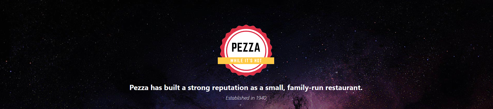

# Pezza Incubator Theme 3.0

A modern, framework-agnostic design system built with Tailwind CSS. Perfect for React, Angular, Vue, Svelte, or vanilla JavaScript projects.



## ✨ What's New in 3.0

- ✅ **Tailwind CSS** - Utility-first approach for maximum flexibility
- ✅ **Clean Design** - Removed gradients, using solid colors for clarity
- ✅ **Modern Colors** - Primary #dc3348 (red), Secondary #fec844 (gold)
- ✅ **Dark Gray Backgrounds** - Replaces old dark blue (#0a0e27 replaced with cleaner neutrals)
- ✅ **Font Pairing** - Belleza (primary) + Cookie (accents)
- ✅ **Theme Switcher** - Light/Dark mode with localStorage persistence
- ✅ **Framework Examples** - React, Angular, Vue integration guides
- ✅ **Email Template** - Professional, clean email design
- ✅ **No Build Required** - Use Tailwind CDN for instant setup

## 🎯 Key Features

| Feature | Benefit |
|---------|---------|
| **Framework Agnostic** | Use with any framework or vanilla JS |
| **Tailwind CSS** | Quick to customize, minimal CSS |
| **Dark Mode** | Built-in light/dark mode system |
| **Responsive** | Mobile-first, works on all devices |
| **Clean Design** | No gradients, solid colors only |
| **CSS Variables** | Easy theming with `--color-primary` |
| **Design Tokens** | Centralized `theme.json` configuration |
| **Accessible** | WCAG compliant color contrasts |

## 🚀 Quick Start (30 seconds)

### Option 1: Using Tailwind CDN (No Build)

```html
<!DOCTYPE html>
<html lang="en">
<head>
    <meta charset="UTF-8" />
    <meta name="viewport" content="width=device-width, initial-scale=1.0" />
    <script src="https://cdn.tailwindcss.com"></script>
    <link href="https://fonts.googleapis.com/css2?family=Belleza&family=Cookie&display=swap" rel="stylesheet" />
    <style>
        :root {
            --color-primary: #dc3348;
            --color-secondary: #fec844;
        }
        body { font-family: 'Belleza', sans-serif; }
        .font-cookie { font-family: 'Cookie', cursive; }
    </style>
</head>
<body class="bg-neutral-900 text-gray-100">
    <button class="bg-primary hover:bg-primary-dark text-white px-6 py-3 rounded-lg">
        Click Me
    </button>
</body>
</html>
```

### Option 2: Using This Theme

1. **Download the theme**:
```bash
git clone <repo> && cd Theme
```

2. **Start local server**:
```bash
npm install
npm run dev
# Visit http://localhost:8000
```

3. **Copy what you need** for your project

## 📦 Project Files

```
Theme/
├── 📄 index.html                        # Live demo
├── 📄 email-template-new.html           # Email template
├── 📄 theme.json                        # Design tokens
├── 📄 tailwind.config.js                # Tailwind config
├── 📄 THEME-INTEGRATION-GUIDE.md        # Full integration guide
├── 📄 QUICK-START-FRAMEWORK.md          # Framework examples
│
├── 📁 js/
│   ├── theme.js                         # Theme switcher
│   └── index.js                         # Form handling
│
├── 📁 images/
│   ├── pezza-logo.png
│   ├── hawaiian.png
│   ├── pepperoni.png
│   ├── regina.png
│   ├── margherita.png
│   └── space-background-dark.jpg
│
└── 📁 css/ (deprecated - use Tailwind)
```

## 🎨 Color System

### Primary Colors
```
Primary (Red):     #dc3348
Primary Dark:      #871a2d
Primary Light:     #fdf2f4

Secondary (Gold):  #fec844
Secondary Dark:    #b27600
Secondary Light:   #fffacd
```

### Neutral Colors
```
Dark Background:   #0a0e27 (or use #111827 for lighter dark)
Light Background:  #ffffff
Text (Light):      #e5e7eb
Text (Dark):       #1a1a1a
```

## 📚 Integration Examples

### React

```jsx
import { useState } from 'react'

export function Button() {
  return (
    <button className="bg-primary hover:bg-primary-dark text-white px-6 py-3 rounded-lg transition">
      Primary Button
    </button>
  )
}

export function App() {
  const [isDark, setIsDark] = useState(true)
  
  return (
    <div className={isDark ? 'dark' : ''}>
      <div className="bg-white dark:bg-neutral-900">
        <Button />
      </div>
    </div>
  )
}
```

See `QUICK-START-FRAMEWORK.md` for full React/Angular/Vue examples.

### Angular

```typescript
import { Component } from '@angular/core'

@Component({
  selector: 'app-button',
  template: `
    <button class="bg-primary text-white px-6 py-3 rounded-lg hover:bg-primary-dark">
      {{ label }}
    </button>
  `
})
export class ButtonComponent {
  label = 'Click Me'
}
```

### Vue

```vue
<template>
  <button class="bg-primary hover:bg-primary-dark text-white px-6 py-3 rounded-lg transition">
    {{ label }}
  </button>
</template>

<script setup>
const label = 'Primary Button'
</script>
```

## 🌙 Dark Mode

### Automatic Theme Switching

The theme includes automatic dark mode detection and localStorage persistence:

```javascript
// js/theme.js
class ThemeSwitcher {
  toggleTheme() {
    const isDark = document.documentElement.classList.toggle('dark')
    localStorage.setItem('pezza-theme', isDark ? 'dark' : 'light')
  }
}
```

### Using with Tailwind

```html
<!-- Light mode (default) -->
<div class="bg-white text-gray-900">Light</div>

<!-- Dark mode with class -->
<div class="bg-neutral-900 dark:bg-black text-white dark:text-gray-100">Dark</div>
```

## 💻 Common Components

### Button
```html
<button class="bg-primary hover:bg-primary-dark text-white font-semibold px-6 py-3 rounded-lg transition transform hover:scale-105">
  Primary Button
</button>
```

### Card
```html
<div class="bg-neutral-800 dark:bg-white rounded-lg p-6 border border-gray-700 dark:border-gray-200 shadow-lg hover:shadow-xl transition">
  <h3 class="text-xl font-bold mb-2">Card Title</h3>
  <p class="text-gray-400 dark:text-gray-600">Description goes here</p>
</div>
```

### Input Field
```html
<input 
  type="text"
  placeholder="Enter text"
  class="w-full bg-neutral-800 dark:bg-gray-100 border border-gray-700 dark:border-gray-300 rounded-lg px-4 py-3 text-gray-100 dark:text-gray-900 focus:border-primary outline-none transition"
/>
```

### Hero Section with Video
```html
<div class="relative w-full h-96 overflow-hidden rounded-lg">
  <video autoplay muted loop class="w-full h-full object-cover">
    <source src="videos/pezza-hero.mp4" type="video/mp4" />
  </video>
  <div class="absolute inset-0 bg-black/50 flex items-center justify-center">
    <h1 class="text-4xl font-bold text-white">Your Title</h1>
  </div>
</div>
```

## 📧 Email Template

Use `email-template-new.html` for order confirmations. Replace variables:

```html
{{CUSTOMER_NAME}}
{{CUSTOMER_EMAIL}}
{{PIZZA_1_NAME}}
{{PIZZA_1_PRICE}}
{{TOTAL}}
{{SPECIAL_INSTRUCTIONS}}
```

## 🎯 Typography

### Font Pairings

```css
/* Primary Font */
font-family: 'Belleza', -apple-system, BlinkMacSystemFont, 'Segoe UI', sans-serif;

/* Accent Font */
font-family: 'Cookie', cursive;
```

### Font Sizes

```html
<h1 class="text-5xl">Large Title</h1>
<h2 class="text-4xl">Section Title</h2>
<h3 class="text-3xl">Subsection</h3>
<p class="text-base">Body text</p>
<span class="text-sm">Small text</span>
```

## 🔧 Customization

### Change Primary Color

1. Update `theme.json`:
```json
"colors": {
  "primary": "#your-color"
}
```

2. Update `tailwind.config.js`:
```javascript
extend: {
  colors: {
    primary: {
      50: "#fff5f7",
      500: "#your-color",
      600: "#darker-shade"
    }
  }
}
```

3. Update CSS variables:
```css
:root {
  --color-primary: #your-color;
}
```

### Add Breakpoints

```javascript
// In tailwind.config.js
extend: {
  screens: {
    'xs': '320px',
    '3xl': '1920px'
  }
}
```

## 📱 Responsive Breakpoints

```
sm:   640px    (small phones)
md:   768px    (tablets)
lg:  1024px    (laptops)
xl:  1280px    (desktops)
2xl: 1536px    (large screens)
```

Usage: `md:text-lg lg:grid-cols-3 xl:px-8`

## 🎓 Learning Resources

1. **Start Here**: `QUICK-START-FRAMEWORK.md` - Framework examples
2. **Full Guide**: `THEME-INTEGRATION-GUIDE.md` - Complete reference
3. **Demo**: Open `index.html` in browser
4. **Tailwind Docs**: https://tailwindcss.com/docs

## 🚢 Deployment

### Without Build (Easiest)
```bash
# Just upload files as-is
# Tailwind CDN is already included in index.html
```

### With Build (Production)
```bash
npm install -D tailwindcss postcss autoprefixer
npx tailwindcss -i ./css/input.css -o ./css/output.css --watch
```

## ⚡ Performance Tips

- Use Tailwind CDN for development, build for production
- Lazy load images (`.jpg`, `.png`)
- Minimize video file sizes
- Use system fonts as fallbacks
- Enable compression on server

## 🐛 Troubleshooting

| Issue | Solution |
|-------|----------|
| Classes not applying | Check Tailwind CDN is loaded |
| Theme not saving | Check localStorage, clear cache |
| Colors look wrong | Verify hex colors match theme.json |
| Fonts not loading | Check Google Fonts connection |
| Video not playing | Ensure correct video path and format |

## 📄 License

MIT - Free to use in personal and commercial projects

## 🤝 Contributing

Found a bug or want to improve the theme? Feel free to:
1. Report issues in GitHub
2. Submit pull requests
3. Share feedback

## Version History

- **3.0.0** (Current) - Tailwind-based, clean design, framework-agnostic
- **2.0.0** - SCSS-based with theme system
- **1.0.0** - Initial release

---

**Ready to get started?** See `QUICK-START-FRAMEWORK.md` for your framework!
