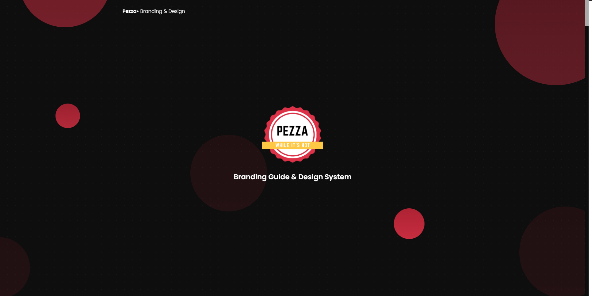

# [Pezza• Branding Guide &amp; Design  System](http://demos.creative-tim.com/blk-design-system/index.html) [![version][version-badge]][CHANGELOG] [![license][license-badge]][LICENSE]



**[Pezza• Branding Guide &amp; Design  System](http://demos.creative-tim.com/blk-design-system/index.html)** is a responsive Bootstrap 4 kit based on Creative Tim Blk Design System. It is a beautiful cross-platform UI kit featuring over 70 elements and 3 templates.

Now will help you create a clean and simple website that is a perfect fit for today's dark theme design. It is built using the 12 column grid system, with components designed to fit together perfectly. It makes use of bold colors, beautiful typography, clear photography and spacious arrangements.

## Complex Documentation

Each element is well presented in a very complex documentation. You can read more about the idea behind this design system here. You can check the components here and the foundation here.

[View Live Documentation](https://entelect-incubator.github.io/design-system/docs/documentation.html)

## Bootstrap 4 Support

Pezza• Design System is built on top of the much-awaited Bootstrap 4. This makes starting a new project very simple. It also provides benefits if you are already working on a Bootstrap 4 project; you can just import the Blk• Design System style over it. Most of the elements have been redesigned; but if you are using an element we have not touched, it will fall back to the Bootstrap default.

## Table of contents

- [Pezza• Branding Guide &amp; Design  System
  - [Complex Documentation](#complex-documentation)
  - [Bootstrap 4 Support](#bootstrap-4-support)
  - [Table of contents](#table-of-contents)
  - [Getting Started](#getting-started)
  - [Example Pages](#example-pages)
  - [Documentation](#documentation)
  - [Tutorial](#tutorial)
  - [Coming soon](#coming-soon)
  - [File Structure](#file-structure)
  - [Browser Support](#browser-support)
  - [Technical Support or Questions](#technical-support-or-questions)
  - [Useful Links](#useful-links)
  - [Social Media:](#social-media)

## Getting Started

We've also included an optional Gulp file to help you get started with theme customization. You'll need to install Node.js and Gulp before using our included gulpfile.js.

1. Download the project's zip
2. Make sure you have node.js (https://nodejs.org/en/) installed
3. Type `npm install` in terminal/console in the source folder where `package.json` is located
4. You will find all the branding colors inside `assets/scss/design-system/custom/_variables.scss`. You can change them with a `HEX` value or with other predefined variables.
5. Run in terminal `gulp compile-scss` for a single compilation or `gulp watch` for continous compilation of the changes that you make in `*.scss` files. This command should be run in the same folder where `gulpfile.js` and `package.json` are located
6. Run in terminal `gulp default` for opening the Dashboard Page (default) of the product.

## Example Pages

We wanted to fully display the power of this kit, so the kit comes packed with examples showing you how to use the components. Inside the product you will find:

+ [Live Preview](https://entelect-incubator.github.io/design-system/)

## Documentation

The documentation for the Blk• Design System is hosted at our [website](https://entelect-incubator.github.io/design-system/docs/documentation.html).

## Tutorial

In order for you to easily be able to use the Blk• Design System, we have created a tutorial page. It shows the structure for the files inside the archive and how to import them. It then features every components with a description and example fr how to use it. You can see the details here ().

## Coming soon

- Vue.js
- Angular
- React
- Sketch
- Photoshop

## File Structure

Within the download you'll find the following directories and files:

```
Pezza• Design System
.
├── CHANGELOG.md
├── README.md
├── assets/
│   ├── css/
│   │   ├── design-system.css
│   │   ├── design-system.css.map
│   │   ├── design-system.min.css
│   │   └── nucleo-icons.css
│   ├── demo/
│   ├── fonts/
│   ├── img/
│   ├── js/
│   │   ├── design-system.js
│   │   ├── design-system.js.map
│   │   ├── design-system.min.js
│   │   ├── core/
│   │   │   ├── bootstrap.min.js
│   │   │   ├── jquery.min.js
│   │   │   └── popper.min.js
│   │   └── plugins/
│   └── scss/
│       ├── design-system/
│       │   ├── bootstrap/
│       │   │   ├── mixins/
│       │   │   └── utilities/
│       │   └── custom/
│       │       ├── cards/
│       │       ├── mixins/
│       │       ├── sections/
│       │       ├── utilities/
│       │       └── vendor/
│       └── design-system.scss
├── docs/
│   └── documentation.html
├── examples/
│   ├── landing-page.html
│   ├── profile-page.html
│   └── register-page.html
├── gulpfile.js
├── index.html
└── package.json
```

## Browser Support

At present, we officially aim to support the last two versions of the following browsers:

   

## Social Media:

* Twitter: <https://twitter.com/Entelect>

[CHANGELOG]: ./CHANGELOG.md
[LICENSE]: ./LICENSE
[version-badge]: https://img.shields.io/badge/version-1.0.0-blue.svg
[license-badge]: https://img.shields.io/badge/license-MIT-blue.svg
